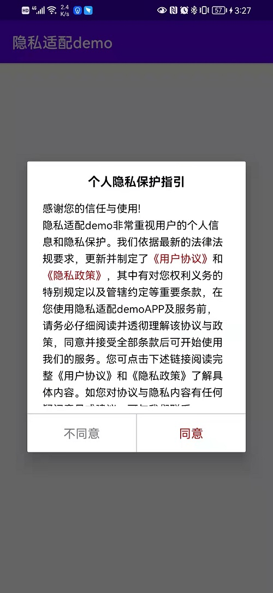

# PrivacyHelper

用来完成隐私改造的库，可以在用户同意之前，拦截sdk的初始化。使项目快速的完成隐私改造。适配的是Android Support 依赖库

# 特点


- 配置简单
- 性能良好
- 可以拦截activity的创建和ContentProvider的创建
- 对原有app的侵入性小
- 不改变原有app的启动流程


# 原理

使用CheckApp 作为Application 。在**attachBaseContext** 方法中判断用户是否同意隐私协议，如果同意。则不hook系统。否则hook系统拦截activity的创建和ContentProvider的创建。一旦用户同意再初始化ContentProvider和相关的sdk。可以参考我以下文章

[Android 控制 ContentProvider的创建](https://blog.csdn.net/qq_22706515/article/details/120269561?spm=1001.2014.3001.5501)

[通过拦截 Activity的创建 实现APP的隐私政策改造](https://blog.csdn.net/qq_22706515/article/details/119250771?spm=1001.2014.3001.5501)


# 使用

## 引入

在项目根目录的build.gradle文件中配置研发中心的maven

```groovy
allprojects {
    repositories {
        google()
        jcenter()
     
        //研发中心的maven库
        maven {url 'http://mvn.devdemo.trs.net.cn/repository/maven-public/'}
    }
}
```


在需要使用的moudle中引入

```groovy
  	//隐私权限拦截
    api 'com.trs.app:privacy-check-support:1.0.4'
```


## 改造Application

将应用中的application 继承自CheckApp

```java
public class MyApp extends CheckApp {

    //onCreate方法在CheckApp中为final避免被误重写。
    
    
    //不需要权限的sdk，可以放在这个方法中初始化。这个方法在应用启动的 时候就会初始化
    @Override
    protected void initSafeSDK() {

        Toast.makeText(this,"不需要权限的sdk初始化成功",Toast.LENGTH_SHORT).show();
    }

    //需要权限的sdk放在这里
    @Override
    protected void initSDK() {
        Toast.makeText(this,"需要敏感权限的sdk初始化功",Toast.LENGTH_SHORT).show();
    }
}

```


## 实现自己的CheckActivity


```java
public class MyCheckActivity extends CheckActivity {


    @Override
    protected void openPrivacyPolicy() {
    	//权限检查自带了一个WebActivity。通过openUrl方法可以查看
        openUrl("http://www.baidu.com","隐私政策");
    }

    @Override
    protected void openUserAgreement() {
        openUrl("http://www.zhihu.com","用户协议");
    }
}
```


## 注册Activity

在清单文件中，通过meta-data的方式注册CheckActivity。value为CheckActivity的全类名。

```xml
   </application>
   		 <meta-data
            android:name="com.trs.app.privacy.check"
            android:value="com.trs.app.demo.MyCheckActivity" />
    </application>
```


# 效果

这个提示框是框架自带的。




